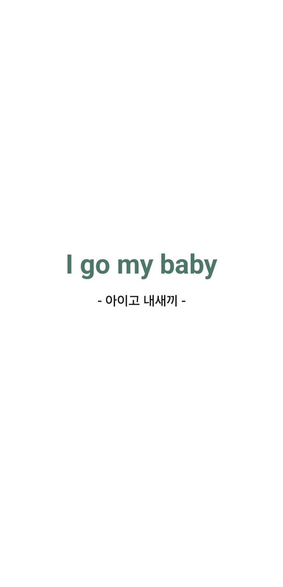
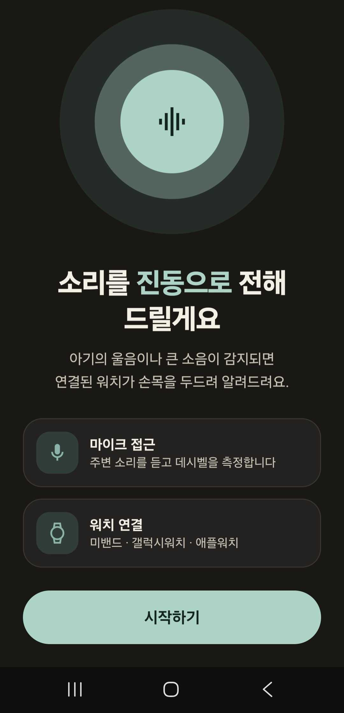
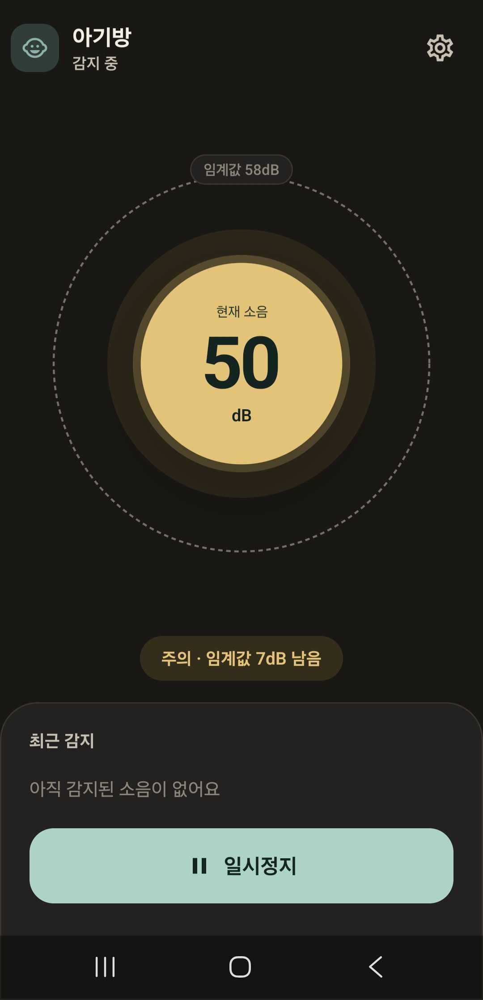
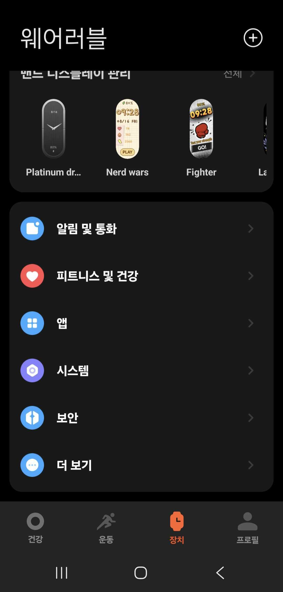
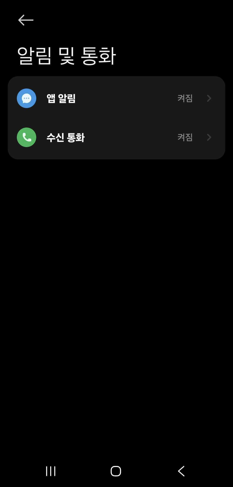
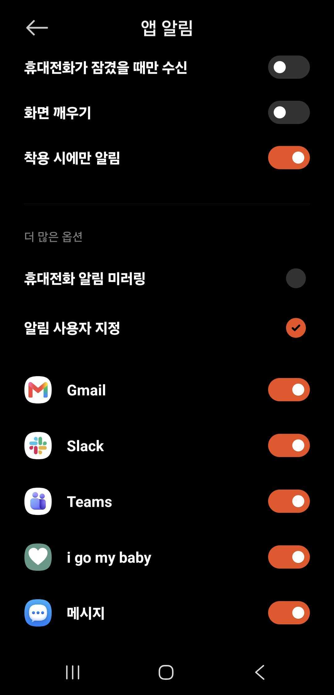

# I Go My Baby

청각이 불편한 부모님들을 위한 안드로이드 소음 감지 앱입니다.
스마트폰의 마이크로 주변의 데시벨을 측정하여, 특정 임계값을 넘으면 시스템 알림을 보냅니다.
워치·스마트밴드를 연결하여 시스템 알림을 손목 진동으로도 받을 수 있습니다.

## 목적

사실 저는 실제로 청각이 불편한 부모님들의 진짜 어려움을 모릅니다.

이러한 어려움이 있으시다면 보편화된 스마트폰을 사용하여 좀 더 도움을 줄 수 있지 않을까 생각하면서 만든 것이라, 실제의 어려움과 다를 수 있습니다.

다만 이러한 기능이 누군가에게는 도움이 될 수 있지 않을까 하는 마음에서 만들게 된 것이라 기능이 모자라거나 실효성이 없다고 해도 양해 부탁드립니다.

## 앱 화면

| 런치 화면 | 온보딩 | 소음 감지 |
| --- | --- | --- |
|  |  |  |

## 주요 기능

- `AudioRecord` 기반 실시간 데시벨 추정 및 화면 표시
- 30~100 dB 범위의 알림 임계값 설정
- 임계값 초과 시 고중요도 알림 전송
- 앱이 백그라운드에 있어도 측정을 지속하는 마이크 포그라운드 서비스
- 첫 실행 온보딩에서 마이크·알림 권한 및 웨어러블 알림 연동 안내

## 기술 구성

- Kotlin, Jetpack Compose, Material 3
- ViewModel + StateFlow
- DataStore Preferences
- Android SDK 26 이상 (target SDK 36)

## 실행 방법

1. Android Studio에서 이 저장소를 엽니다.
2. Android SDK 36이 설치된 기기 또는 에뮬레이터를 선택합니다.
3. 앱을 실행한 후 마이크와 알림 권한을 허용합니다.

명령줄에서는 다음을 실행할 수 있습니다.

```bash
./gradlew installDebug
```

## 권한

| 권한 | 용도 |
| --- | --- |
| `RECORD_AUDIO` | 주변 소리 측정 |
| `POST_NOTIFICATIONS` | 소음 감지 알림 표시 (Android 13 이상) |
| `FOREGROUND_SERVICE`, `FOREGROUND_SERVICE_MICROPHONE` | 백그라운드 마이크 측정 유지 |

## 워치·스마트밴드 알림

앱은 특정 웨어러블 SDK에 직접 연결하지 않고 Android 시스템 알림을 사용합니다. Mi Fitness, Galaxy Wearable, Wear OS 등에서 **I Go My Baby의 알림 전달**을 켜면 기기의 정책에 따라 워치 또는 밴드가 진동합니다.

### Mi Fitness 연동 방법

1. Mi Fitness 앱에서 하단의 **장치** 탭을 연 뒤 **알림 및 통화**를 선택합니다.
2. **앱 알림**을 선택합니다.
3. 앱 목록에서 **i go my baby**를 활성화합니다.

| 1. 알림 및 통화 | 2. 앱 알림 | 3. i go my baby 활성화 |
| --- | --- | --- |
|  |  |  |

## 참고 사항

표시되는 dB 값은 스마트폰 마이크의 PCM 신호를 바탕으로 계산한 **상대적인 추정치**입니다. 기기별 마이크 특성과 주변 환경에 따라 실제 음압과 차이가 날 수 있으므로, 필요한 환경에서 임계값을 직접 조절해 사용하세요. 이 앱은 의료기기나 안전장비를 대체하지 않습니다.

## 테스트

```bash
./gradlew test
```
